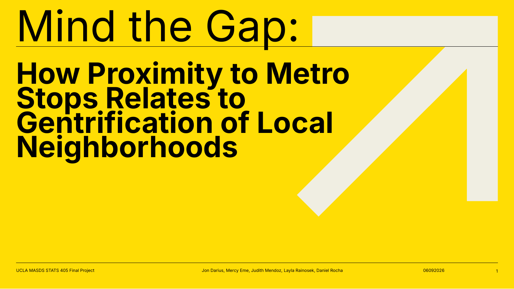

# Mind the Gap: LA Metro Proximity and Gentrification Risk



This project examines how proximity to Los Angeles Metro stations relates to a composite measure of neighborhood change and asks how the planned D Line extension may shift that risk around the 2028 Olympic corridor. It combines rental listings, LA Metro station locations, and 2019/2024 American Community Survey (ACS) estimates in a reproducible Python workflow.

> **Portfolio note:** This is an observational class project, not a causal impact study or a policy forecast. The repository preserves the submitted analysis while documenting known reproducibility and interpretation caveats.

**Project deliverables:** [scholarly article](reports/scholarly_article.pdf) · [presentation](reports/LA_Metro_Gentrification_Risk_Presentation.pdf) · [analysis notebook](notebooks/transit_gentrification_analysis.ipynb)

## Research questions

1. Do rental listings inside a 0.5-mile transit-oriented development buffer have higher Composite Gentrification Risk Scores (CGRS) than listings farther from stations?
2. How well do linear, random-forest, and XGBoost models reconstruct CGRS from listing, neighborhood, and transit-proximity features?
3. Under the submitted counterfactual, how would predicted CGRS change if listings in the D Line corridor were assigned station-like proximity?

## Headline results

| Result | Submitted estimate |
|---|---:|
| Clean listings before the 5-mile filter | 21,214 |
| Listings retained within 5 miles of a Metro station | 15,889 |
| TOD-buffer median CGRS | 0.125 |
| Non-TOD median CGRS | -0.112 |
| Mann–Whitney test | $U=25{,}290{,}586$, $p<0.001$ |
| Best A/E-line cross-validated model | XGBoost |
| XGBoost A/E-line CV RMSE / $R^2$ | 0.173 / 0.885 |
| Corridor listings in the counterfactual | 1,947 |
| Median-of-scenarios shift | -0.013 CGRS units |

The model comparison identifies XGBoost as the best cross-validated model. However, the submitted counterfactual code uses the fitted **random forest**, not XGBoost. The distinction is preserved and explained in [reproducibility notes](docs/reproducibility_notes.md).

## Repository map

| Path | Contents |
|---|---|
| `notebooks/` | Clean, portable version of the submitted notebook |
| `src/analysis.py` | Script export of the notebook workflow |
| `data/raw/` | Public Metro station data and instructions for the excluded listing file |
| `docs/` | Data dictionary, methodology, and reproducibility notes |
| `paper/` | LaTeX source, bibliography, and submitted figures |
| `reports/` | Scholarly article, executive summary, and presentation |
| `results/reference/` | Small reference tables transcribed from the submitted run |
| `outputs/` | Generated figures and tables; ignored by Git except for placeholders |

## Reproduce the analysis

The raw housing listing file is intentionally not included because it contains exact addresses and agent phone numbers and its redistribution rights are unclear. Place an authorized copy at:

```text
data/raw/housing_combined_data_geocoded.csv
```

Then run:

```bash
python -m venv .venv
source .venv/bin/activate          # Windows: .venv\Scripts\activate
pip install -r requirements.txt
cp .env.example .env
# Add your Census API key to .env
jupyter lab notebooks/transit_gentrification_analysis.ipynb
```

The workflow downloads ACS 5-year data from the [U.S. Census Bureau API](https://www.census.gov/data/developers/data-sets/acs-5year.html) and caches it under `data/cache/`. Metro station data originated from [LA Metro's GTFS schedule data](https://developer.metro.net/gtfs-schedule-data/).

You can also execute the exported script from the repository root:

```bash
python src/analysis.py
```

Figures are written to `outputs/figures/`. Runtime depends on the machine because the workflow performs five-fold cross-validation for two tree ensembles.

## Methods in brief

The Composite Gentrification Risk Score averages five standardized components:

$$
\mathrm{CGRS}_i = \frac{z(RP_i)+z(RB_i)+z(SRA_i)+z(PSP_i)+z(EDC_i)}{5},
$$

where `RP` is rent premium, `RB` is rent burden, `SRA` is ZIP-level rent appreciation, `PSP` is price per square foot, and `EDC` is change in bachelor's-or-higher educational attainment. See [methodology](docs/methodology.md) for definitions and model settings.

## Important limitations

- The analysis is cross-sectional and does not identify a causal effect of rail investment.
- Several predictors are also used to construct CGRS, so high predictive performance partly reflects target reconstruction rather than independent forecasting.
- Random five-fold cross-validation does not account for spatial or temporal dependence.
- The counterfactual changes distance and TOD status while holding all other characteristics fixed; it is a scenario, not an estimated treatment effect.
- The submitted report and code disagree on the model used for that scenario, and two different “median shift” summaries appear in the notebook. Both issues are documented in [reproducibility notes](docs/reproducibility_notes.md).

## Project team

Jon Darius · Mercy Eme · Judith Mendoz · Layla Rainosek · Daniel Rocha  
MAS 405, UCLA · Spring 2026

## Citation and reuse

Use [CITATION.cff](CITATION.cff) for attribution. No open-source license was selected on behalf of the five-person team; see [LICENSE](LICENSE).
